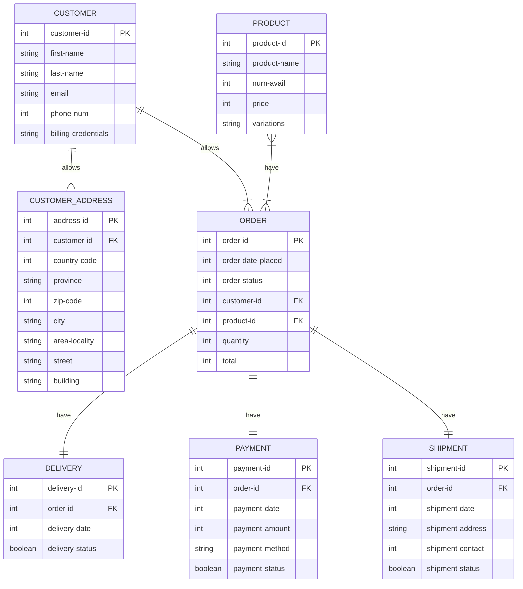

```mermaid
    erDiagram
    CUSTOMER ||--|{ CUSTOMER_ADDRESS: allows

    CUSTOMER{
        int customer-id PK
        string first-name
        string last-name
        string email
        int phone-num
        string billing-credentials
    }

    CUSTOMER_ADDRESS{
        int address-id PK
        int customer-id FK
        int country-code
        string province
        int zip-code
        string city
        string area-locality
        string street
        string building
    }

    CUSTOMER ||--|{ ORDER: allows
    ORDER{
        int order-id PK
        int order-date-placed
        int order-status
        int customer-id FK
        int product-id FK
        int quantity
        int total
    }

    ORDER ||--|| DELIVERY: have
    DELIVERY{
        int delivery-id PK
        int order-id FK
        int delivery-date
        boolean delivery-status
    }

    ORDER ||--|| PAYMENT: have
    PAYMENT{
        int payment-id PK
        int order-id FK
        int payment-date
        int payment-amount
        string payment-method
        boolean payment-status
    }

    ORDER ||--|| SHIPMENT: have
    SHIPMENT{
        int shipment-id PK
        int order-id FK
        int shipment-date
        string shipment-address
        int shipment-contact
        boolean shipment-status
    }

    PRODUCT }|--|{ ORDER: have
    PRODUCT{
        int product-id PK
        string product-name
        int num-avail
        int price
        string variations
    }

```